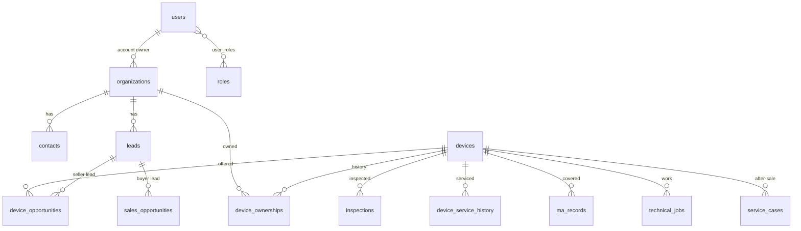
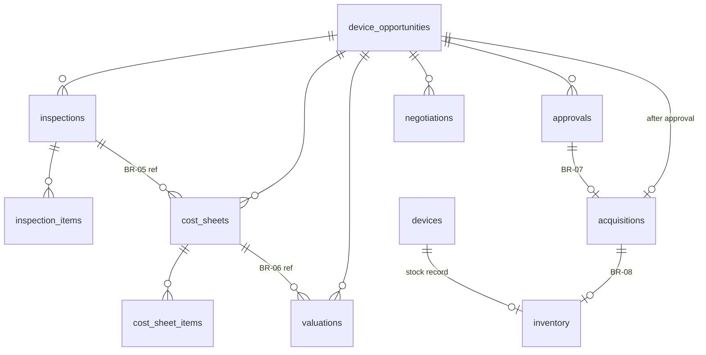
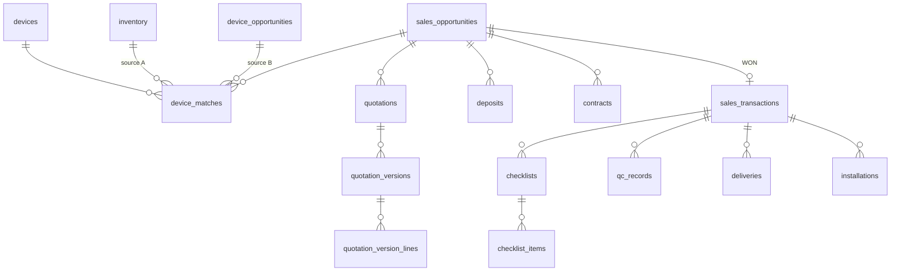

# 01 — ERD และ Relational Schema

## ข้อตกลงร่วม (ใช้กับทุกตาราง)

| เรื่อง | ข้อกำหนด |
|---|---|
| Primary key | `id` UUID (สเปกข้อ 5) |
| เลขอ้างอิงที่คนอ่าน | `ref_no` unique แยกจาก id รันผ่านตาราง `ref_counters` ภายใน transaction เดียวกับการสร้าง record |
| คอลัมน์ audit | `created_at`, `created_by_id`, `updated_at`, `updated_by_id` ทุกตารางธุรกิจ |
| Soft delete | `archived_at`, `archived_by_id`, `archive_reason` (ข้อมูลลูกค้า/เครื่อง) |
| Void | `voided_at`, `voided_by_id`, `void_reason` (ข้อมูลการเงิน/อนุมัติ/ธุรกรรม ห้ามลบจริงจาก UI — BR-15) |
| เงิน | `Decimal(14,2)` สกุล THB (ของเดิมใช้ Float จะไม่ใช้ในตารางใหม่) |
| ค่า status/type | String + ค่าคงที่ใน `src/lib/constants.ts` (ตามแบบเดิม เพื่อให้ใช้ได้ทั้ง SQLite/Postgres/MySQL) ตรวจที่ backend ทุกครั้ง |
| Task / Activity / Document | ผูกกับ record ใดก็ได้ผ่าน `parent_type` + `parent_id` (polymorphic) และตรวจว่า parent มีอยู่จริงใน service layer เพราะ DB บังคับ FK แบบ polymorphic ไม่ได้ |

รูปแบบเลขอ้างอิง 🟡: `ORG-000001`, `DEV-000001`, `LD-2026-0001`, `DO-2026-0001`, `ACQ-2026-0001`,
`INV-000001`, `SO-2026-0001`, `QTN-2026-0001`, `CTR-2026-0001`, `TRX-2026-0001`, `JOB-2026-0001`, `SC-2026-0001`

## ERD — ลูกค้าและเครื่อง

## ERD — ฝั่งซื้อ (Acquisition)

## ERD — ฝั่งขาย (Sales)

Task, Activity และ Document ผูกได้กับทุก object หลัก ส่วน `audit_logs` เก็บการเปลี่ยนแปลงของทุกตาราง

## ตาราง (37 ตารางตามสเปก + 6 ตารางเสริม)

### สิทธิ์และผู้ใช้

| # | ตาราง | คอลัมน์หลัก |
|---|---|---|
| 1 | `users` | username (unique, ใช้เข้าสู่ระบบ), email (unique, ไม่บังคับ), password_hash, must_change_password, name, phone, active, last_login_at, **session_version** (เพิ่มค่าเพื่อเตะ session ทิ้งทันทีเมื่อปิดบัญชี/เปลี่ยนสิทธิ์) |
| 2 | `roles` | code (unique): `GM`, `SALES_COORDINATOR`, `SALES_EXECUTIVE`, `SALES_DIRECTOR`, `SERVICE_ENGINEER`, `SERVICE_DIRECTOR`, `MARKETING`, `MANAGEMENT`, 🟡`ADMIN`; name, description |
| 3 | `user_roles` | user_id, role_id — unique(user_id, role_id) คนเดียวมีได้หลาย role สิทธิ์รวมกัน |

### ลูกค้า

| # | ตาราง | คอลัมน์หลัก |
|---|---|---|
| 4 | `organizations` | ref_no, name, type (CLINIC/HOSPITAL/DEALER/INDIVIDUAL/OTHER), tax_id, branch, phone, line_id, email, address, province, account_owner_id→users, notes, *soft delete* |
| 5 | `contacts` | organization_id (nullable สำหรับบุคคลทั่วไป), name, position, phone, line_id, email, is_primary, notes, *soft delete* |
| 6 | `leads` | ref_no, **type (SELLER/BUYER)**, organization_id, contact_id, source (master data), owner_id, status, **next_action, next_follow_up_date** (BR-01), summary, lost_reason, converted_at |

### เครื่อง

| # | ตาราง | คอลัมน์หลัก |
|---|---|---|
| 7 | `devices` | ref_no (**Device_ID ถาวร**), brand, model, technology/category, serial_number, serial_normalized (unique เมื่อไม่ว่าง), manufacture_year, installation_year, current_owner_org_id (null = AMN Sure), current_location, usage_value, usage_unit (SHOT/PULSE/HOUR), usage_recorded_at, **commercial_status**, **technical_status**, accessories_note, *soft delete* |
| + | `device_ownerships` | device_id, organization_id (null = AMN Sure), from_date, to_date, source (INITIAL/ACQUISITION/SALE/MANUAL), acquisition_id, sales_transaction_id — ใช้แสดงเจ้าของปัจจุบันและเจ้าของก่อนหน้าในหน้า Device 360 |
| 8 | `device_opportunities` | ref_no, device_id, lead_id, seller_org_id, seller_contact_id, owner_id, status, asking_price, expected_price, reason_for_sale, location, usage_snapshot, accessories, next_action, next_follow_up_date, final_negotiated_price, lost_reason |
| 9 | `inspections` | device_id, device_opportunity_id (nullable), engineer_id, requested_by_id, requested_at, scheduled_at, started_at, completed_at, status, **overall_result** (PASS/MINOR_ISSUE/MAJOR_ISSUE); ส่วน *technical summary*: overall_condition, issues, required_repair, recommended_repair, missing_accessories, technical_risk (LOW/MEDIUM/HIGH), est_repair_days |
| 10 | `inspection_items` | inspection_id, category (EXTERIOR/FUNCTIONAL/HANDPIECE/ACCESSORIES/ERRORS/USAGE/CONSUMABLES/SAFETY/SOFTWARE/PARTS), item_name, **is_mandatory**, result (PASS/MINOR_ISSUE/MAJOR_ISSUE/MISSING/NA), note — สร้างจาก template ใน master data |
| 11 | `device_service_history` | device_id, service_date, type (PM/CM/REPAIR/PART_REPLACEMENT/UPGRADE), description, parts_replaced, performed_by, cost 🔒, is_repeat_failure, source (INTERNAL/EXTERNAL_RECORD), technical_job_id |
| 12 | `ma_records` | device_id, provider, contract_no, start_date, end_date, coverage, cost 🔒 (สถานะ ACTIVE/EXPIRED คำนวณจากวันที่) |
| 13 | `cost_sheets` | device_opportunity_id, **inspection_id (บังคับ — BR-05)**, version_no, status (DRAFT/SUBMITTED), total_estimated_cost 🔒 (คำนวณแล้วเก็บ), prepared_by_id, submitted_at |
| 14 | `cost_sheet_items` | cost_sheet_id, category (ACQUISITION_ASSUMPTION/REPAIR/PARTS/REFURBISHMENT/ACCESSORIES/TRANSPORT/INSTALLATION/WARRANTY_PROVISION/OTHER), description, amount 🔒 |
| 15 | `valuations` | device_opportunity_id, **cost_sheet_id (อ้างอิง ไม่เขียนทับ — BR-06)**; ข้อมูลที่กรอก: asking_price, total_cost_snapshot, market_selling_price, historical_selling_price, condition, age_years, usage, demand, technical_risk, expected_days_to_sell; ผลลัพธ์: fair_market_value, recommended_acq_price, max_acq_price, target_selling_price, min_selling_price, expected_gp, expected_gp_margin 🔒 ทั้งหมด |
| 16 | `negotiations` | device_opportunity_id, party (AMN_OFFER/SELLER_COUNTER), amount, offered_at, user_id, note, is_final — เพิ่มได้อย่างเดียว ห้ามแก้ |
| 17 | `approvals` | subject_type (DEVICE_OPPORTUNITY 🟡 และอาจมี QUOTATION), subject_id, requested_by_id, requested_at, approver_id, decision (PENDING/APPROVED/APPROVED_WITH_CONDITION/REVISION_REQUIRED/REJECTED), decided_at, condition_text, comment, approved_amount, **package_snapshot (JSON)** — เก็บข้อมูลทั้งชุดที่ GM เห็นตอนกดอนุมัติ |
| 18 | `acquisitions` | ref_no, device_opportunity_id (unique), approval_id (บังคับ — BR-07), device_id, seller_org_id, purchase_price 🔒, purchase_date, payment_status, takes_stock, *void* |
| 19 | `inventory` | ref_no, device_id (active ได้แค่ 1 แถว), acquisition_id, received_date, storage_location, status (IN_STOCK/RESERVED/SOLD/REMOVED), book_cost 🔒, list_price |

### การขาย

| # | ตาราง | คอลัมน์หลัก |
|---|---|---|
| 20 | `sales_opportunities` | ref_no, lead_id, buyer_org_id, contact_id, owner_id, status; *requirement*: brand, model, technology, budget_min, budget_max, preferred_condition, accessories_required, warranty_required, installation_required, expected_purchase_date; next_action, next_follow_up_date, lost_reason |
| 21 | `device_matches` | sales_opportunity_id, device_id, inventory_id **หรือ** device_opportunity_id (ต้องมีอย่างใดอย่างหนึ่งเท่านั้น — BR-09), status (PROPOSED/SHORTLISTED/SELECTED/REJECTED), note |
| 22 | `quotations` | ref_no, sales_opportunity_id, current_version_no |
| 23 | `quotation_versions` | quotation_id, version_no, status (DRAFT/APPROVED/SENT/ACCEPTED/REJECTED/EXPIRED/SUPERSEDED), subtotal, vat_rate, vat_amount, total, warranty_terms, payment_terms, delivery_terms, installation_terms, valid_until, approved_by_id, sent_at, accepted_at — **ล็อกเป็นอ่านอย่างเดียวเมื่อส่งแล้วหรือถูกแทนที่** (BR-10) |
| + | `quotation_version_lines` | quotation_version_id, device_id, description, condition, accessories, unit_price, qty — รองรับกรณีดีลเดียวมีหลายเครื่อง (ดู Q25) |
| 24 | `deposits` | sales_opportunity_id, quotation_version_id, required_amount, due_date, received_amount, received_date, status (WAITING_DEPOSIT/DEPOSIT_RECEIVED/REFUNDED/FORFEITED), evidence_document_id, recorded_by_id, verified_by_id |
| 25 | `contracts` | ref_no, sales_opportunity_id, quotation_version_id, contract_no, price, payment_terms, warranty_terms, delivery_terms, installation_terms, signed_date, status (DRAFT/CONTRACT_SIGNED/VOID), signed_document_id |
| 26 | `sales_transactions` | ref_no, sales_opportunity_id (unique), quotation_version_id, contract_id, buyer_org_id, total_price, status, won_at, completed_at, *void* |
| 27 | `checklists` | sales_transaction_id, section (COMMERCIAL/SALES/MARKETING/TECHNICAL), owner_role, status, completed_at, completed_by_id |
| 28 | `checklist_items` | checklist_id, label, is_mandatory, done, done_by_id, done_at, note, document_id |
| 29 | `qc_records` | sales_transaction_id, device_id, engineer_id, checked_at, **checks (JSON: serial, exterior, functions, output, handpiece, accessories, software, errors, safety, cleaning, packaging → PASS/FAIL + note)**, overall_result (PASS/FAIL) |
| 30 | `deliveries` | sales_transaction_id, device_id (BR-13), scheduled_date, delivered_date, address, transport_method, engineer_id, serial_confirmed, accessories_delivered, receiving_person, status |
| 31 | `installations` | sales_transaction_id, device_id (BR-13), installed_date, engineer_id, result (SUCCESS/PARTIAL/FAILED), system_test_result, customer_accepted, accepted_by_name, training_done, notes |

### งานปฏิบัติการและข้อมูลกลาง

| # | ตาราง | คอลัมน์หลัก |
|---|---|---|
| 32 | `technical_jobs` | ref_no, type (INSPECTION/REPAIR/REFURBISH/QC/DELIVERY/INSTALLATION/PM), device_id, parent_type, parent_id, assigned_engineer_id, status, scheduled_at, completed_at, hours, parts_used — **ใบงานช่าง** |
| 33 | `service_cases` | ref_no, device_id, organization_id, reported_at, issue, under_warranty, status, resolution — งานบริการหลังการขาย |
| 34 | `tasks` | title, type, parent_type, parent_id, assignee_id, assignee_role, due_date, priority, status (OPEN/IN_PROGRESS/DONE/CANCELLED), completed_at — **สิ่งที่ต้องทำ** ของทุกคน |
| 35 | `activities` | parent_type, parent_id, organization_id และ device_id (เก็บซ้ำไว้เพื่อให้ timeline หน้า 360 query เร็ว), type (CALL/LINE/EMAIL/MEETING/VISIT/NOTE/STATUS_CHANGE/SYSTEM), occurred_at, user_id, summary, outcome |
| 36 | `documents` | parent_type, parent_id, category (PHOTO/VIDEO/CONTRACT/PAYMENT_EVIDENCE/INVOICE/INSPECTION_REPORT/OTHER), file_name, mime_type, size_bytes, storage_key, uploaded_by_id, *soft delete* |
| 37 | `audit_logs` | entity_type, entity_id, action (CREATE/UPDATE/STATUS_CHANGE/APPROVE/VOID/ARCHIVE/LOGIN/LOGIN_FAILED), changes (JSON `[{field, old, new}]`), user_id, at, ip — **เขียนเพิ่มได้อย่างเดียว** |
| + | `ref_counters` | key (เช่น `DO-2026`), last_value |
| + | `app_settings` | key, value (JSON) — เช่น `won_rule`, `vat_rate`, `deposit_default_pct` |
| + | `master_data` | type (BRAND/MODEL/TECHNOLOGY/LEAD_SOURCE/INSPECTION_TEMPLATE/CHECKLIST_TEMPLATE/…), code, label, sort, active |
| + | `login_attempts` | email, ip, at, success — ใช้จำกัดการเดารหัสผ่าน |

🔒 = ข้อมูลการเงินที่ต้องซ่อนจาก role ที่ไม่มีสิทธิ์ (ดู 03 และ Q5) — ตัดออกตั้งแต่ฝั่ง server ไม่ใช่แค่ซ่อนใน UI

## Index และ constraint สำคัญ

- `devices.serial_normalized` unique (เมื่อไม่ null) และ index `(brand, model)` เพื่อเตือนเครื่องซ้ำ
- `inventory(device_id)` ที่ status ≠ SOLD/REMOVED ได้แค่ 1 แถว (ตรวจใน service เพราะ SQLite ไม่มี partial unique ผ่าน Prisma)
- `acquisitions.device_opportunity_id` unique, `sales_transactions.sales_opportunity_id` unique
- `quotation_versions(quotation_id, version_no)` unique
- index `(parent_type, parent_id)` ใน tasks/activities/documents และ `(entity_type, entity_id)` ใน audit_logs
- index `(owner_id, next_follow_up_date)` ใน leads, device_opportunities, sales_opportunities สำหรับหน้า Dashboard และ OVERDUE

## การเตือนเครื่องซ้ำ (ข้อ 8)

ก่อนสร้าง device ระบบจะค้นหา:
1. `serial_normalized` ตรงกันทุกตัวอักษร (ตัดช่องว่าง/ขีด แปลงเป็นตัวใหญ่) → **บล็อก** และเสนอให้ผูกกับเครื่องเดิม
2. brand + model เดียวกัน และเจ้าของหรือสถานที่เดียวกัน → **เตือน** ผู้ใช้ยืนยันแล้วสร้างต่อได้ (บันทึกลง audit)
