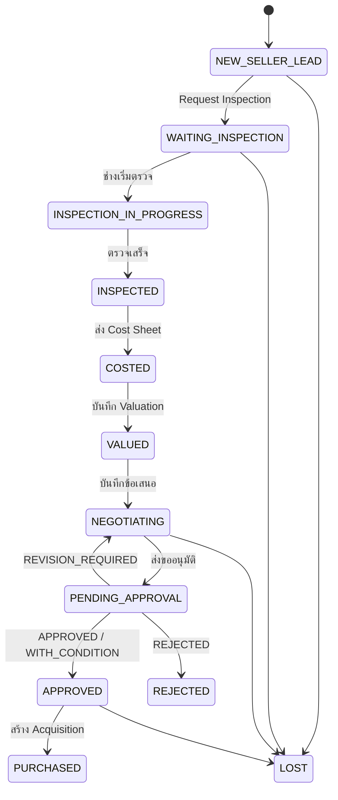
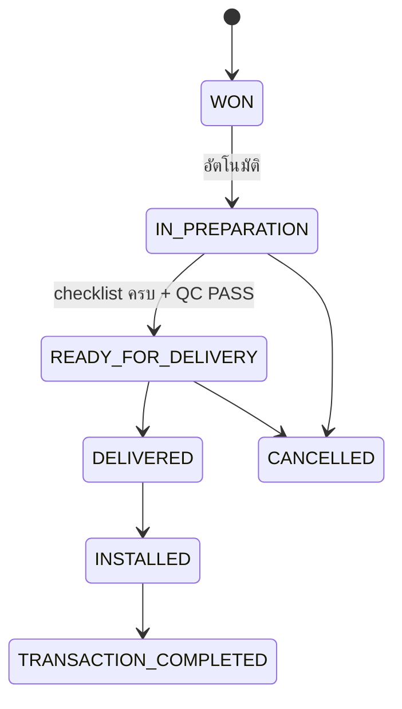

# 02 — Status / State Transition

กฎทั่วไป:
- ทุกการเปลี่ยนสถานะทำผ่าน service function ฝั่ง server ที่ **ตรวจสถานะต้นทาง + สิทธิ์ + เงื่อนไข** ก่อน (ข้อ 12)
- ถ้าต้องสร้างหลาย record พร้อมกัน ต้องอยู่ใน `prisma.$transaction` เดียว ถ้าขั้นใดล้ม ต้องไม่มีอะไรถูกบันทึก
- ทุกการเปลี่ยนสถานะเขียน `audit_logs` (STATUS_CHANGE) และ `activities` (SYSTEM) ใน transaction เดียวกัน
- 🟡 = ชื่อสถานะหรือขั้นตอนที่สเปกไม่ได้ระบุ ผมเสนอเพิ่มเอง

## A. ฝั่งซื้อ — `device_opportunities.status`

| จาก | การกระทำ | ไป | ใครทำได้ | เงื่อนไข (guard) | ผลข้างเคียงใน transaction เดียวกัน |
|---|---|---|---|---|---|
| — | สร้าง Seller Lead | `NEW_SELLER_LEAD` | Sales Coordinator | มี org/contact, ช่องทางติดต่อ, brand/model, expected price, location, lead source; **BR-01** มี owner + next action + follow-up date | ค้นหาเครื่องซ้ำ (01) แล้วผูกเครื่องเดิมหรือสร้างใหม่; `device.commercial_status = UNDER_OFFER` |
| NEW_SELLER_LEAD | Request Inspection | `WAITING_INSPECTION` | Sales Coordinator | ข้อมูลเครื่องครบ: brand, model, serial (หรือเหตุผลที่ไม่มี), ปีผลิต, สถานที่, asking price | สร้าง `inspections` (REQUESTED) + `technical_jobs` + `tasks` ให้ Service Engineering (**BR-02**) |
| WAITING_INSPECTION | เริ่มตรวจ | 🟡`INSPECTION_IN_PROGRESS` | Service Engineer | — | สร้าง `inspection_items` จาก template |
| INSPECTION_IN_PROGRESS | ตรวจเสร็จ | 🟡`INSPECTED` | Service Engineer | **BR-03** มี overall_result, ทุกข้อ mandatory มีผล (ไม่ว่าง), กรอก technical summary แล้ว | อัปเดต `device.technical_status`; ปิดใบงาน; สร้าง task คืนให้ owner ฝั่งขาย (**BR-04**) |
| INSPECTED | ส่ง Cost Sheet | 🟡`COSTED` | Service Director | **BR-05** อ้าง inspection_id ที่ COMPLETED; มีอย่างน้อย 1 รายการ | คำนวณ total_estimated_cost; ส่ง cost sheet ใหม่ได้เสมอ (version+1) |
| COSTED | บันทึก Valuation | 🟡`VALUED` | ❓ Q7 | **BR-06** สร้าง record ใหม่ที่อ้าง cost_sheet_id ห้ามแก้ cost sheet | คำนวณ GP / margin (สูตรดู Q9) |
| VALUED / NEGOTIATING | บันทึกข้อเสนอ/ข้อเสนอโต้กลับ | 🟡`NEGOTIATING` | Sales Exec, Sales Director, GM | amount > 0 | เพิ่มแถว `negotiations` (ห้ามแก้แถวเก่า) |
| NEGOTIATING | ส่งขออนุมัติ | 🟡`PENDING_APPROVAL` | Sales Exec, Sales Director | มี final negotiated price, cost sheet ล่าสุด และ valuation ล่าสุด | สร้าง `approvals` + **package_snapshot**; task ให้ GM |
| PENDING_APPROVAL | APPROVED / APPROVED_WITH_CONDITION | 🟡`APPROVED` | **GM เท่านั้น** | ถ้าเป็น WITH_CONDITION ต้องกรอก condition_text | ปิด approval (แก้ไม่ได้อีก); task ให้ owner ไปสร้าง Acquisition |
| PENDING_APPROVAL | REVISION_REQUIRED | `NEGOTIATING` ❓Q12 | GM | ต้องกรอก comment | task คืนให้ owner |
| PENDING_APPROVAL | REJECTED | 🟡`REJECTED` (จบ) | GM | ต้องกรอก comment | `device.commercial_status = EXTERNAL` |
| APPROVED | สร้าง Acquisition | `PURCHASED` | ❓Q13 | **BR-07** approval ล่าสุดเป็น APPROVED*; ราคาซื้อ ≤ approved_amount ❓Q13 | สร้าง `acquisitions`; `device_ownerships` ปิดของผู้ขาย เปิดของ AMN Sure; device → `PURCHASED`; ถ้า takes_stock → สร้าง `inventory` + device → `IN_INVENTORY` (**BR-08**) |
| สถานะที่ยังไม่จบ | ยกเลิก (ผู้ขายถอน/ไม่ตกลง) | 🟡`LOST` (จบ) | owner, Sales Director, GM | ต้องระบุ lost_reason | ปิด task ที่ค้าง; device → `EXTERNAL` |

## B. ฝั่งขาย — `sales_opportunities.status`

| จาก | การกระทำ | ไป | ใครทำได้ | เงื่อนไข | ผลข้างเคียง |
|---|---|---|---|---|---|
| — | สร้าง Buyer Lead | 🟡`NEW_BUYER_LEAD` | Sales Coordinator, Sales Exec | BR-01 | — |
| NEW_BUYER_LEAD | บันทึก Requirement | 🟡`REQUIREMENT_DEFINED` | Sales Director | brand/model หรือ technology, budget, expected date | — |
| REQUIREMENT_DEFINED | ค้นหา + เลือกเครื่อง | 🟡`MATCHING` | Sales Director, Sales Exec | ระบบค้นจาก (A) inventory IN_STOCK และ (B) device_opportunity ที่ยังไม่จบ (**BR-09**) | สร้าง `device_matches` |
| MATCHING | สร้าง Quotation | 🟡`QUOTING` | Sales Coordinator, Sales Exec | มี match ที่ SELECTED อย่างน้อย 1 | สร้าง `quotations` + version 1 (DRAFT) |
| QUOTING | ครบเงื่อนไข WON | `WON` | **ระบบ (อัตโนมัติ)** | **BR-11** ตรวจทุกครั้งที่ quotation/deposit/contract เปลี่ยน: ค่าตั้งต้น = quotation ACCEPTED + deposit RECEIVED + contract SIGNED; เครื่องที่เลือกยังไม่ถูกจองโดยดีลอื่น | สร้าง `sales_transactions` + `checklists`/`checklist_items` จาก template; inventory → RESERVED; device → `RESERVED` |
| สถานะที่ยังไม่จบ | แพ้/ยกเลิก | 🟡`LOST` | owner, Sales Director, GM | lost_reason | ปิด task |

### Quotation version — `quotation_versions.status`

| จาก | การกระทำ | ไป | ใคร | เงื่อนไข |
|---|---|---|---|---|
| — | สร้าง / แก้ไขราคา | `DRAFT` | Sales Coord, Sales Exec | แก้ได้เฉพาะ DRAFT |
| DRAFT | อนุมัติ | `APPROVED` | ❓Q14 | ถ้าราคา < min_selling_price อาจต้องให้ GM ❓Q14 |
| APPROVED | ส่งลูกค้า | `SENT` | Sales Coord, Sales Exec | ล็อกแก้ไม่ได้ |
| SENT | ลูกค้าตอบรับ / ปฏิเสธ | `ACCEPTED` / `REJECTED` | Sales Coord, Sales Exec | ACCEPTED ได้แค่ 1 version ต่อดีล |
| SENT | เลยวันหมดอายุ | `EXPIRED` | ระบบ | valid_until < วันนี้ |
| ใดก็ได้ยกเว้น ACCEPTED | ปรับราคา (revise) | เดิม → `SUPERSEDED`, ใหม่ = `DRAFT` | Sales Coord, Sales Exec | **BR-10** version เก่าอ่านได้อย่างเดียว |

### Deposit และ Contract

| ตาราง | การเปลี่ยน | ใคร | เงื่อนไข |
|---|---|---|---|
| deposits | `WAITING_DEPOSIT` → `DEPOSIT_RECEIVED` | ❓Q16 | มี received_amount ≥ required_amount, received_date และแนบหลักฐานการโอน |
| deposits | → `REFUNDED` / `FORFEITED` | GM | ระบุเหตุผล |
| contracts | `DRAFT` → `CONTRACT_SIGNED` | Sales Coord, Sales Director | แนบสัญญาที่ลงนามแล้ว + signed_date |
| contracts | → `VOID` | GM | ระบุเหตุผล |

## C. หลังปิดการขาย — `sales_transactions.status`

| จาก | ไป | ใคร | เงื่อนไข | ผลข้างเคียง |
|---|---|---|---|---|
| WON | 🟡`IN_PREPARATION` | ระบบ | — | สร้าง task ให้แต่ละหมวด checklist (Commercial/Sales/Marketing/Technical) |
| IN_PREPARATION | `READY_FOR_DELIVERY` | Service Engineer | checklist item ที่เป็น mandatory ครบทุกหมวด + **ทุกเครื่องมี `qc_records` ล่าสุดเป็น PASS (BR-12)** | task จัดส่ง |
| READY_FOR_DELIVERY | 🟡`DELIVERED` | Service Engineer | ทุกเครื่องมี delivery ที่ serial ตรงกับ device (**BR-13**) + ผู้รับ + หลักฐาน | device → `DELIVERED` |
| DELIVERED | 🟡`INSTALLED` | Service Engineer | ทุกเครื่องมี installation result = SUCCESS และลูกค้ายอมรับ | — |
| INSTALLED | `TRANSACTION_COMPLETED` | ระบบ (อัตโนมัติ) | — | ownership ย้ายไปผู้ซื้อ ❓Q18; inventory → SOLD; device → 🟡`INSTALLED_AT_CUSTOMER` |
| ก่อน DELIVERED | 🟡`CANCELLED` | GM | ระบุเหตุผล | คืนการจองเครื่อง (inventory → IN_STOCK) |

QC ที่ FAIL จะไม่เปลี่ยนสถานะ transaction แต่สร้าง technical_job ซ่อม แล้วทำ QC ใหม่ (record ใหม่ เก็บของเก่าไว้)

## D. สถานะของเครื่อง (`devices`)

**commercial_status** 🟡: `EXTERNAL` → `UNDER_OFFER` → `PURCHASED` → `IN_INVENTORY` → `RESERVED` → `DELIVERED` →
`INSTALLED_AT_CUSTOMER` (ถ้าต่อมาลูกค้าอยากขายคืน วนกลับไป `UNDER_OFFER` ได้ — Device_ID เดิม)

**technical_status** 🟡: `UNKNOWN`, `INSPECTED_OK`, `NEEDS_REPAIR`, `UNDER_REPAIR`, `READY`, `QC_PASSED`

สถานะของเครื่องไม่ให้ผู้ใช้แก้ตรง ๆ แต่เปลี่ยนตาม workflow ข้างบนเท่านั้น (Admin แก้ได้พร้อมบันทึกเหตุผลลง audit)

## E. อื่น ๆ

| Object | สถานะ | หมายเหตุ |
|---|---|---|
| leads | `OPEN` → `CONTACTED` → `QUALIFIED` → `CONVERTED` / `DISQUALIFIED` 🟡 | **OVERDUE ไม่เก็บใน DB** คำนวณจาก `active && next_follow_up_date < วันนี้` (ใช้กับ device/sales opportunity ด้วย) |
| approvals | `PENDING` → การตัดสินใจ 4 แบบ | ตัดสินแล้วแก้ไม่ได้ ถ้าต้องการใหม่ต้องส่งขออนุมัติรอบใหม่ |
| tasks | `OPEN` → `IN_PROGRESS` → `DONE` / `CANCELLED` | งานของระบบปิดอัตโนมัติเมื่อขั้นตอนที่เกี่ยวข้องเสร็จ |
| technical_jobs | `OPEN` → `SCHEDULED` → `IN_PROGRESS` → `DONE` / `CANCELLED` | |
| service_cases | `OPEN` → `IN_PROGRESS` → `RESOLVED` → `CLOSED` | |
